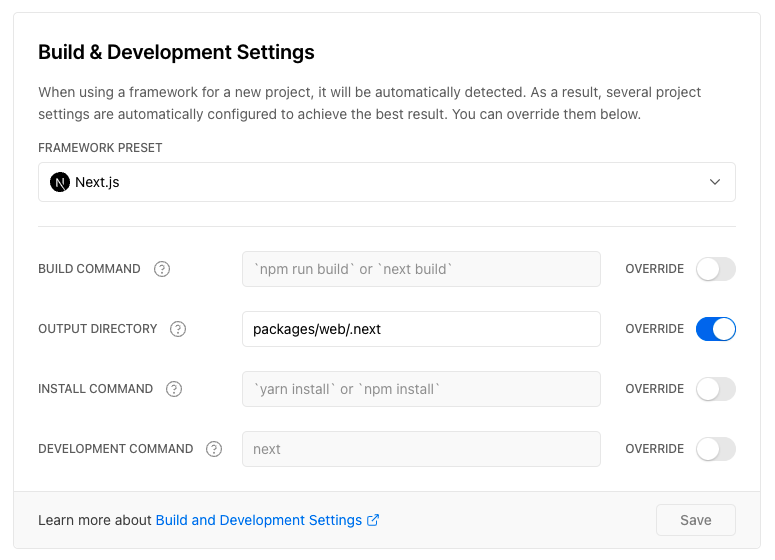

## NextJS x NestJS

Refer to [Skn0tt/nextjs-nestjs-integration-example](https://github.com/Skn0tt/nextjs-nestjs-integration-example) but using yarn workspace

### Vercel Settings



### Development

```
yarn dev
```

### Build

```
yarn build
```

For `@nestjs/platform-fastify`, edit `packages/server/src/index.ts` with folloing code

```ts
import 'reflect-metadata';
import http from 'http';
import { NestFactory } from '@nestjs/core';
import { FastifyAdapter, NestFastifyApplication } from '@nestjs/platform-fastify';
import { NextApiHandler } from 'next';
import { AppModule } from './app.module';

let app: NestFastifyApplication;
let appPromise: Promise<NestFastifyApplication>;

export async function getApp() {
  if (app) return app;

  if (!appPromise) {
    appPromise = new Promise<NestFastifyApplication>(async resolve => {
      const appInCreation = await NestFactory.create<NestFastifyApplication>(AppModule, new FastifyAdapter());
      appInCreation.setGlobalPrefix('api');
      await appInCreation.init();
      await appInCreation.getHttpAdapter().getInstance().ready();
      resolve(appInCreation);
    });
  }

  app = await appPromise;
  return app;
}

export async function getListener() {
  const app = await getApp();
  const server: http.Server = app.getHttpServer();
  const [listener] = server.listeners('request') as NextApiHandler[];
  return listener;
}
```
